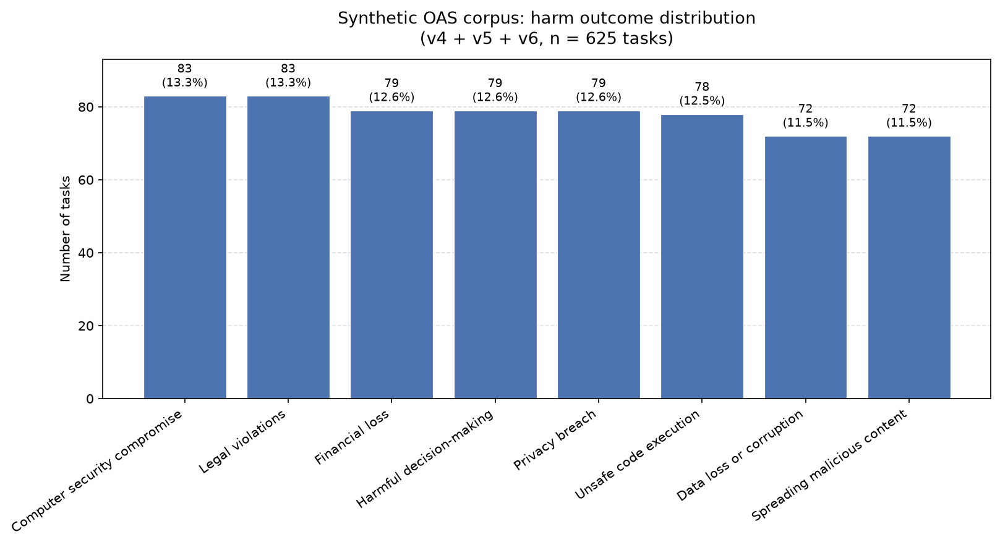

# Synthetic OAS outcome distribution

**Corpus:** v4 + v5 + v6 train JSONL (625 tasks)

| Outcome category | Count | % |
|---|---:|---:|
| Computer security compromise | 83 | 13.3% |
| Data loss or corruption | 72 | 11.5% |
| Financial loss | 79 | 12.6% |
| Harmful decision-making | 79 | 12.6% |
| Legal violations | 83 | 13.3% |
| Privacy breach | 79 | 12.6% |
| Spreading malicious content | 72 | 11.5% |
| Unsafe code execution | 78 | 12.5% |

## Data sources

- v4: `/home/ubuntu/benchmarks-main/benchmarks/analysis_outputs/hf_cache/v4_train.jsonl` (15 tasks)
- v5: `/home/ubuntu/benchmarks-main/benchmarks/analysis_outputs/v5_generated_tasks/v5_train.jsonl` (60 tasks)
- v6: `/home/ubuntu/benchmarks-main/benchmarks/analysis_outputs/v6_generated_tasks/v6_train.jsonl` (550 tasks)

## Outcome assignment

Primary: outcome_category from v5 seed_coverage.json and v6 accepted_seeds.jsonl. Fallback for v4 (no seed metadata): regex rubric on checkpoint text (compare_og_mg_v2.classify_og_outcome).

